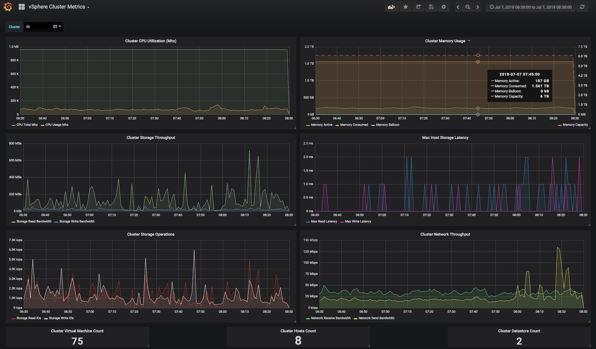

# vSphere Graphite

Monitors VMware vSphere stats using govmomi. Sinks metrics to one of many time series backends.

Written in go to achieve fast sampling rates and high throughput sink. Successfuly benchmarked against 3000 VM's, logging 150,000 metrics per minute to an ElasticSearch backend.

## Build status

Travis: [](https://travis-ci.org/cblomart/vsphere-graphite)

Drone: [](https://bot.blomart.net/cblomart/vsphere-graphite)

## Code report

[](https://goreportcard.com/report/github.com/cblomart/vsphere-graphite)
[](https://app.fossa.io/projects/git%2Bgithub.com%2Fcblomart%2Fvsphere-graphite?ref=badge_shield)

## Example dashboard

The dashboard example below is using the grafana UI. The backend is using ElasticSearch.



## Configuration

Define vSphere credentials and collection metrics in the JSON config file. An example configuration for the Contoso domain is found [here](./vsphere-graphite-example.json).

Copy this config file to /etc/*binaryname*.json and modify as needed. Example:
  > cp vsphere-graphite-example.json /etc/vsphere-graphite.json

<!-- provide link to vcenter role permissions -->

Metrics collection is performed by associating ObjectType groups with Metric groups.
These are expressed via the vsphere scheme: *group*.*metric*.*rollup*

ObjectTypes are explained in [this](https://code.vmware.com/web/dp/explorer-apis?id=196) vSphere doc.

Performance metrics are explained in [this](https://docs.vmware.com/en/VMware-vSphere/6.5/com.vmware.vsphere.monitoring.doc/GUID-E95BD7F2-72CF-4A1B-93DA-E4ABE20DD1CC.html) vSphere doc.

You can select the extra data collected by using the "Properties" property:

* datastore: reports the datastores associated with a virtual machine
* host: reports the host the virtual machine runs on
* cluster: reports the cluster the virtual machine is in
* network: reports the network the virtual machine is connected to
* resourcepool: reports the resourcepool the virtual machine is in
* folder: reports the folder the virtual machine is in
* tags: reports the tags associated with the virtual machine
* numcpu: reports the number of virtual cpus the virtual machine has
* memorysizemb: reports the quantity of memory the virtual machine has
* disks: reports the logical disks capacity inside the virtua machine
* **all**: reports all the information

### Backend parameters

* Type (BACKEND_TYPE): Type of backend to use. Currently "graphite", "influxdb", "thinfluxdb" (embeded influx client), "elastic", and "fluentd"
* Hostname (BACKEND_HOSTNAME): hostname were the backend is running
* Port (BACKEND_PORT): port to connect to for the backend
* Encrypted (BACKEND_ENCRYPTED): enable or disable TLS to backend (true, false)
* Username (BACKEND_USERNAME): username to connect to the backend (influxdb and optionally for thinfluxdb & elasticsearch)
* Password (BACKEND_PASSWORD): password to connect to the backend (influxdb and optionally for thinfluxdb & elasticsearch)
* Database (BACKEND_DATABASE): database to use in the backend (influxdb, thinfluxdb, elasticsearch)
* NoArray (BACKEND_NOARRAY): don't use csv 'array' as tags, only the first element is used (influxdb, thinfluxdb)
* Tag (BACKEND_TAG): tag to use in the backend (fluent)

## Execute vsphere-graphite as a container

All builds are pushed to docker:

* [cblomart/vsphere-graphite](https://hub.docker.com/r/cblomart/vsphere-graphite/)
* [cblomart/rpi-vsphere-graphite](https://hub.docker.com/r/cblomart/rpi-vsphere-graphite/)

Default tags includes:

* commit for specific commit in the branch (usefull to run from tip)
* latest for latest release
* specific realease tag or version

The JSON configration file can be passed by mounting to /etc. Edit the configuration file and set it in the place you like here $(pwd)

  > docker run -t -v $(pwd)/vsphere-graphite.json:/etc/vsphere-graphite.json cblomart/vsphere-graphite:latest

Backend parameters can be set via environment variables to make docker user easier (having graphite or influx as another container).

## Execute vsphere-graphite in shell

Heavilly based on [govmomi](https://github.com/vmware/govmomi) but also on [daemon](github.com/takama/daemon) which provides simple daemon/service integration.

### Install golang

Of course [golang](https://golang.org) is needed.
refer to [install](https://golang.org/doc/install) and don't forget to set `$GOPATH`.

Gopath example:

```bash
mkdir /etc/golang
export GOPATH=/etc/golang
```

Then install vsphere-graphite with GO:

  > go get github.com/cblomart/vsphere-graphite

The executable should be `$GOPATH/bin/vsphere-graphite` and is now a binary for your architecture/OS

### Run on Commandline

  > vsphere-graphite

### Install as a service

  > vsphere-graphite install

### Run as a service

  > vsphere-graphite start
  >
  > vsphere-graphite status
  >
  > vsphere-graphite stop

### Remove service

  > vsphere-graphite remove

## Contributors

No open source projects would live and thrive without common effort. Here is the section were the ones that help are thanked:

* [sofixa](https://github.com/sofixa)
* [BlueAceTS](https://github.com/BlueAceTS)
* [NoMotion](https://github.com/NoMotion)
* [korservick](https://github.com/korservick)
* [MnrGreg](https://github.com/mnrgreg)
* [fdmsantos](https://github.com/fdmsantos)
* [dupondje](https://github.com/dupondje)
* [jlothian](https://github.com/jlothian)

Also keep in mind that if you can't contribute code, issues and imporvement request are also a key part of a project evolution!
So don't hesitate and tell us what doens't work or what you miss.

## Donations

This project is largely alive because of the forementioned contributors. Our time is precious bet it is even more precious to us when we can spend it on our beloved projects. So don't hesitate to make a donation:

Bitcoin address: 1BQqpYfQc9NqykaK4rEH5bFsik1VffKHmQ

## License

The MIT License (MIT)

Copyright (c) 2016 cblomart

Permission is hereby granted, free of charge, to any person obtaining a copy of this software and associated documentation files (the "Software"), to deal in the Software without restriction, including without limitation the rights to use, copy, modify, merge, publish, distribute, sublicense, and/or sell copies of the Software, and to permit persons to whom the Software is furnished to do so, subject to the following conditions:

The above copyright notice and this permission notice shall be included in all copies or substantial portions of the Software.

THE SOFTWARE IS PROVIDED "AS IS", WITHOUT WARRANTY OF ANY KIND, EXPRESS OR IMPLIED, INCLUDING BUT NOT LIMITED TO THE WARRANTIES OF MERCHANTABILITY, FITNESS FOR A PARTICULAR PURPOSE AND NONINFRINGEMENT. IN NO EVENT SHALL THE AUTHORS OR COPYRIGHT HOLDERS BE LIABLE FOR ANY CLAIM, DAMAGES OR OTHER LIABILITY, WHETHER IN AN ACTION OF CONTRACT, TORT OR OTHERWISE, ARISING FROM, OUT OF OR IN CONNECTION WITH THE SOFTWARE OR THE USE OR OTHER DEALINGS IN THE SOFTWARE.

## Licenses dependencies

[](https://app.fossa.io/projects/git%2Bgithub.com%2Fcblomart%2Fvsphere-graphite?ref=badge_large)
